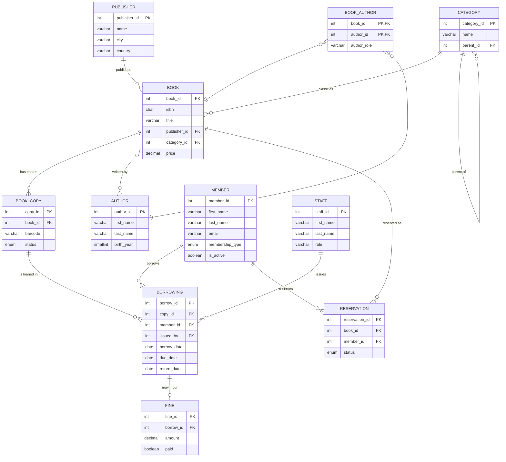

# ER Diagram — Library Management System

Rendered with Mermaid (GitHub/VS Code preview shows it visually). A crow's-foot
ER diagram of all 11 entities and their relationships.

## Relationship summary (cardinality & participation)

| Relationship | Cardinality | Participation |
|---|---|---|
| Publisher–Book | 1 : M | Book total (every book has a publisher); Publisher partial |
| Category–Book | 1 : M | Book total; Category partial |
| Category–Category | 1 : M (recursive) | both partial (parent optional) |
| Book–Author | M : N (via BOOK_AUTHOR) | both partial |
| Book–BookCopy | 1 : M | BookCopy total |
| BookCopy–Borrowing | 1 : M | Borrowing total |
| Member–Borrowing | 1 : M | Borrowing total; Member partial |
| Staff–Borrowing | 1 : M | Borrowing partial (issued_by nullable) |
| Borrowing–Fine | 1 : 1 (0..1) | Fine total; Borrowing partial |
| Book/Member–Reservation | 1 : M | Reservation total |
